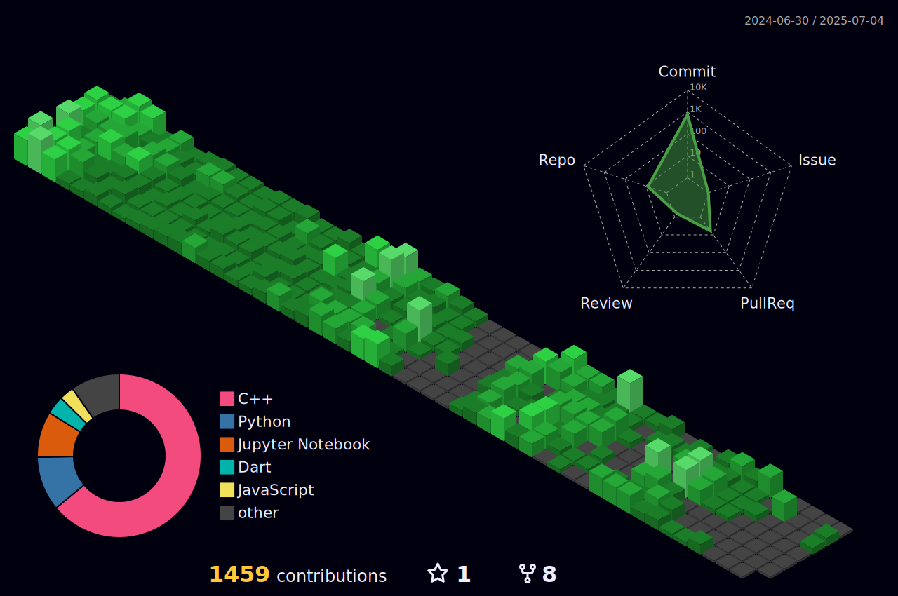

# 👋 Hi there! I'm Ahmed Yar

🎓 **Computer Science Student** at **NUST**  
💡 Passionate about **Python**, **Data Structures**, **Artificial Intelligence**, **Cryptography**, and **Software Development**

Welcome to my GitHub! Here, you’ll find a collection of projects and experiments as I explore the exciting world of technology. I love **solving challenging problems**, optimizing algorithms, and building **scalable** applications.

---

## 🌱 **What I’m Learning & Exploring:**

🔹 **Advanced Data Structures & Algorithms** – Optimizing solutions for performance & scalability.  
🔹 **Machine Learning & AI** – Leveraging **TensorFlow, Keras, Scikit-Learn, Pandas**, and **NumPy** for predictive modeling.  
🔹 **Cryptography & Security** – Implementing secure protocols and encryption techniques.  
🔹 **Full-Stack Development** – Building applications using **Python, C++, MySQL, Flask**, and **JavaScript**.  
🔹 **Data Visualization & Analytics** – Creating insightful visualizations with **Matplotlib, Seaborn, and Plotly**.  
🔹 **Automation & Scripting** – Using **Selenium & Git** for task automation and version control.

---

## 🚀 **Tech Stack:**

💻 **Languages & Frameworks**: Python, C++, JavaScript, Flutter  
📊 **Data Science & AI**: NumPy, Pandas, Scikit-Learn, TensorFlow, Keras  
🎨 **Frontend & UI**: HTML5, CSS3, JavaScript, Flutter  
🛠 **Tools & Platforms**: Git, GitHub, Selenium, Jupyter Notebook, Ubuntu  
📈 **Data Visualization**: Matplotlib, Plotly, Seaborn

---

<h3 align="center"> Programming Languages </h3>

|  |  |  |  |  |  |
| :---------------------------------------------------------------: | :---------------------------------------------------------: | :---------------------------------------------------------------: | :---------------------------------------------------------------: | :---------------------------------------------------------------------------------------: | :--------------------------------------------: |
|                              Python                               |                             C++                             |                            JavaScript                             |                            TypeScript                             |                                           Dart                                            |                    Markdown                    |

---

<h3 align="center"> 🌐 Web & App Developments <h3 align="center">  </h3> </h3>

|  |  |  |  |  |  |
| :-----------------------------------------------------------------------------------: | :--------------------------------------------------------------------------------: | :-------------------------------------------------------------: | :-------------------------------------------------------------: | :------------------------------------------------------------------------------------------------------------: | :------------------------------------------------------------------------------------------------: |
|                                         HTML5                                         |                                        CSS3                                        |                              React                              |                              Redux                              |                                                  TailwindCSS                                                   |                                              Flutter                                               |

---

<h3 align="center"> 📊 Data Science & Machine Learning </h3>

|  |  |  |  |  |  |
| :-----------------------------------------------------------------------------------: | :--------------------------------------------------------------------------------------: | :--------------------------------------------------------------------------------------------------: | :------------------------------------------------------------------------------------------------------: | :--------------------------------------------------------------------------------------------------: | :-----------------------------------------------------------------------------------: |
|                                         NumPy                                         |                                          Pandas                                          |                                              Matplotlib                                              |                                               Scikit-learn                                               |                                              TensorFlow                                              |                                         Keras                                         |

---

<h3 align="center">📁 Databases </h3>

|  |  |  |  |
| :-------------------------------------------------------------: | :---------------------------------------------------------------------------------------------------------: | :------------------------------------------------------------------------------------------: | :------------------------------------------------------------------------------------------: |
|                              MySQL                              |                                                   MongoDB                                                   |                                            Redis                                             |                                            Neo4j                                             |

---

<h3 align="center"> Tools and Platform </h3>

|  |  |  |  |  |
| :--------------------------------------------: | :---------------------------------------------------------------: | :---------------------------------------------------------------------------------------------: | :---------------------------------------------------------------------------------------------------: | :--------------------------------------------------------------: |
|                      Git                       |                              GitHub                               |                                             Ubuntu                                              |                                               Selenium                                                |                            REST APIs                             |

---

<h2 align="center">GitHub Stats</h2>

###

###

###

 

    <table>
        <tr>
             <td align="center">
                
            </td>
            <td align="center">
                
            </td> 
         </tr> 
        <tr>
            <td colspan="2" align="center">
                
            </td>
        </tr>
    </table>

