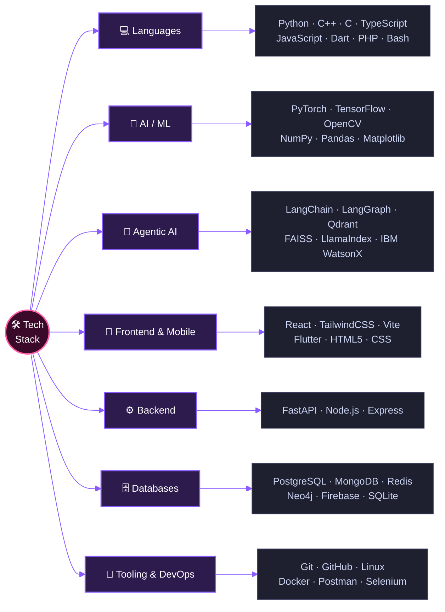

<div align="center">
  <h1>Ahmed Yar</h1>
  <p><i>Senior Year Computer Science</i></p>
</div>

## 🧠 Background

I am a Computer Science student based in Quetta, Pakistan, navigating the intersection of **Artificial Intelligence** and **low-level systems**. I thrive in deep-work environments building scalable architectures, training neural networks, and exploring how code interacts with the machine at its core, and some time like to dive into the classic form of problem solving at [Leetcode](https://leetcode.com/u/ahmedyar7/) and won the Bronze Medal at Digital Pakistan Speed Programming Competition 2025 and won 3rd Position in University level Competition.

## 🔭 Current Focus

Currently diving deep into the bridge between human logic and machine execution:

- **Systems Engineering:** Compiler Construction, Parallel & Distributed Computing
- **Artificial Intelligence:** Deep Learning, Computer Vision, RAG architectures
- **Data Engineering:** Big Data Analytics, Federated Learning

<!--START_SECTION:waka-->

```txt
From: 22 June 2026 - To: 22 July 2026

Python               46 hrs 32 mins        █████████████▓░░░░░░░░░░░   54.86 %
C++                  17 hrs 57 mins        █████▒░░░░░░░░░░░░░░░░░░░   21.16 %
JavaScript           11 hrs 25 mins        ███▒░░░░░░░░░░░░░░░░░░░░░   13.47 %
Markdown             3 hrs 58 mins         █▒░░░░░░░░░░░░░░░░░░░░░░░   04.69 %
Bash                 1 hr 3 mins           ▒░░░░░░░░░░░░░░░░░░░░░░░░   01.24 %
```

<!--END_SECTION:waka-->



```mermaid
---
config:
  theme: base
  themeVariables:
    fontSize: 14px
    lineColor: '#8a5cff'
  layout: fixed
---
flowchart LR
    TS(("🛠️ Tech<br>Stack")) --> LANG["💻 Languages"] & AIML["🧠 AI / ML"] & AGENT["🤖 Agentic AI"] & FE["🎨 Frontend & Mobile"] & BE["⚙️ Backend"] & DB["🗄️ Databases"] & DEV["🚀 Tooling & DevOps"]
    LANG --> L["Python · C++ · C · TypeScript<br>JavaScript · Dart · PHP · Bash"]
    AIML --> M["PyTorch · TensorFlow · OpenCV<br>NumPy · Pandas · Matplotlib"]
    AGENT --> G["LangChain · LangGraph · Qdrant<br>FAISS · LlamaIndex · IBM WatsonX"]
    FE --> F["React · TailwindCSS · Vite<br>Flutter · HTML5 · CSS"]
    BE --> B["FastAPI · Node.js · Express"]
    DB --> D["PostgreSQL · MongoDB · Redis<br>Neo4j · Firebase · SQLite"]
    DEV --> V["Git · GitHub · Linux<br>Docker · Postman · Selenium"]

     TS:::root
     LANG:::cat
     AIML:::cat
     AGENT:::cat
     FE:::cat
     BE:::cat
     DB:::cat
     DEV:::cat
     L:::leaf
     M:::leaf
     G:::leaf
     F:::leaf
     B:::leaf
     D:::leaf
     V:::leaf
    classDef root fill:#3b0a2a,stroke:#ff5fa2,stroke-width:2px,color:#fff
    classDef cat fill:#2d1b4e,stroke:#8a5cff,stroke-width:1.5px,color:#fff
    classDef leaf fill:#1e2030,stroke:#3d4160,color:#cdd6f4
```

<div align="center">
  <p>
    <a href="mailto:ahmedyar.info@gmail.com">Email</a> • 
    <a href="https://linkedin.com/in/ahmedyar7">LinkedIn</a> • 
    <a href="https://medium.com/@ahmedyar7">Medium</a> • 
    <a href="https://ahmedyar.vercel.app">Portfolio</a>
  </p>
</div>
